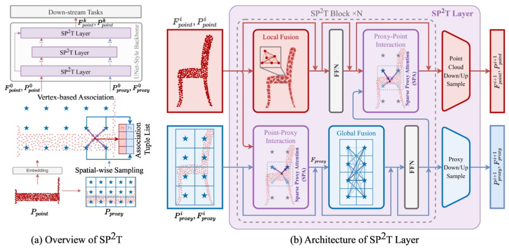
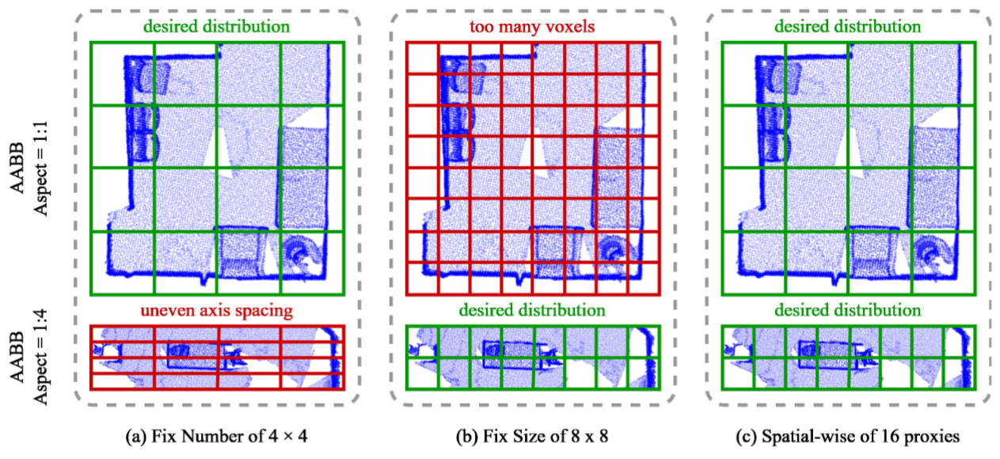
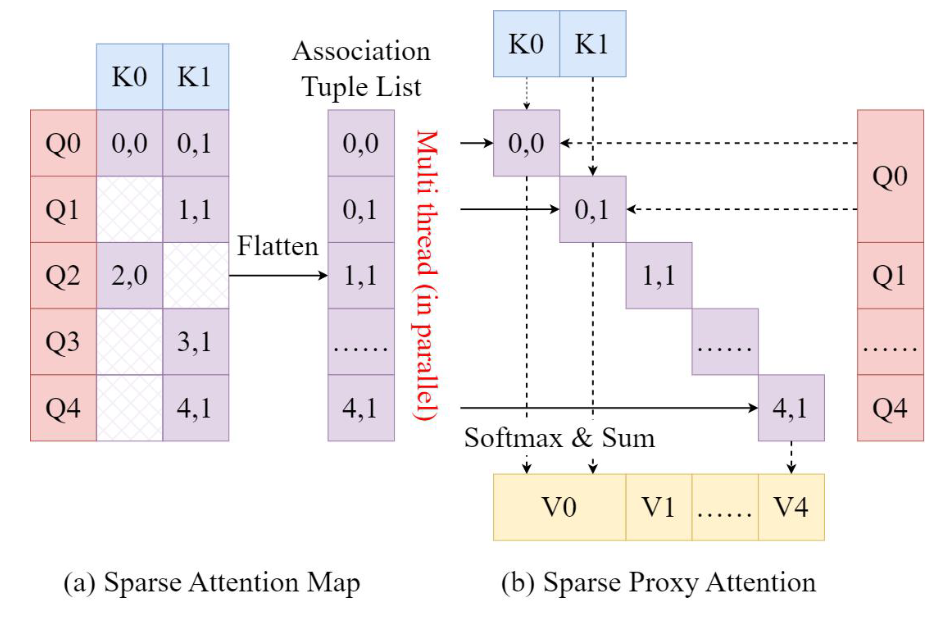

<div align="center">
  <h1 style="font-size: 32px; font-weight: bold;"> SP<sup>2</sup>T: Sparse Proxy Attention for Dual-stream Point Transformer </h1>

 <a href="https://arxiv.org/abs/2412.11540">
    
  </a>
  <a href="https://huggingface.co/wanjiaxu/SP2T">
    
  </a>
  <a href="https://github.com/WallelWan/SP2T">
    
  </a>  

</div>

## Sparse Proxy Point Transformer

**Key insights**:

- We introduce a dual-stream architecture maintains local-global balance through parallel branches.

<p align="center">
  
</p>

- We introduce spatial-wise proxy sampling with vertex-based associations enables robust sampling on geometrically diverse point clouds.

<p align="center">
  
</p>

- We introduce sparse proxy attention with a table-based relative bias effectively achieves the interaction with efficient map-reduce computation.

<p align="center">
  
</p>


## News

* Jul 18, 2025: Update for Camera ready.
* Jun 25, 2025: :tada: Congratulations, SP<sup>2</sup>T is accepted by ICCV 2025.
* Dec 16, 2024: First commit. 

## Quick Start

* Our model file is location in pointcept/models/sparse_proxy_point_transformer.
* The training log and val/test result is location in ./submit. We will update the weight of SP<sup>2</sup>T if our paper is accepted.
* The config is location in ./config.

## Installation

### Environment

* Basic Environment

Please use the setup.sh to install requirements.

```
bash setup.sh
```

* Flash Attention

Please follow the offical guide in repository of Flash Attention.


## Data Prepare

Please follow the offical guide of Pointcept fot prepare Scannet, Scannet200, S3DIS and nuScenes.

## Model Zoo

### Indoor Semantic Segmentation

The test mIOU of Scannet and Scannet 200 uses the TTA for validation. All test results are measured by the official website. We hope that these metrics will provide a clean and reproducible benchmark for subsequent paper.

#### ScanNet

<div style="width: 100%; overflow-x: auto;">
<table style="width: 100%; border-collapse: collapse; table-layout: fixed;">
<tr>
<th style="text-align: center; border: 1px solid #ddd; padding: 8px; width: 12.5%;">Model</th>
<th style="text-align: center; border: 1px solid #ddd; padding: 8px; width: 12.5%;">BenchMark</th>
<th style="text-align: center; border: 1px solid #ddd; padding: 8px; width: 12.5%;">Additional Data</th>
<th style="text-align: center; border: 1px solid #ddd; padding: 8px; width: 12.5%;">Val mIOU</th>
<th style="text-align: center; border: 1px solid #ddd; padding: 8px; width: 12.5%;">Test mIOU*</th>
<th style="text-align: center; border: 1px solid #ddd; padding: 8px; width: 12.5%;">Config</th>
<th style="text-align: center; border: 1px solid #ddd; padding: 8px; width: 12.5%;">Weight</th>
<th style="text-align: center; border: 1px solid #ddd; padding: 8px; width: 12.5%;">Result</th>
</tr>
<tr>
<td style="text-align: center; border: 1px solid #ddd; padding: 8px;">MinkUnet</td>
<td style="text-align: center; border: 1px solid #ddd; padding: 8px;">ScanNet</td>
<td style="text-align: center; border: 1px solid #ddd; padding: 8px;">✗</td>
<td style="text-align: center; border: 1px solid #ddd; padding: 8px;">72.2</td>
<td style="text-align: center; border: 1px solid #ddd; padding: 8px;">73.4</td>
<td style="text-align: center; border: 1px solid #ddd; padding: 8px;"></td>
<td style="text-align: center; border: 1px solid #ddd; padding: 8px;"></td>
<td style="text-align: center; border: 1px solid #ddd; padding: 8px;"></td>
</tr>
<tr>
<td style="text-align: center; border: 1px solid #ddd; padding: 8px;">Octformer (Reproduction)</td>
<td style="text-align: center; border: 1px solid #ddd; padding: 8px;">ScanNet</td>
<td style="text-align: center; border: 1px solid #ddd; padding: 8px;">✗</td>
<td style="text-align: center; border: 1px solid #ddd; padding: 8px;">74.6</td>
<td style="text-align: center; border: 1px solid #ddd; padding: 8px;">70.7</td>
<td style="text-align: center; border: 1px solid #ddd; padding: 8px;"></td>
<td style="text-align: center; border: 1px solid #ddd; padding: 8px;"></td>
<td style="text-align: center; border: 1px solid #ddd; padding: 8px;"><a href="https://github.com/TerenceWallel/Sparse-Proxy-Point-Transformer/tree/main/submit/others/scannet-semseg-octformer-v1m1-0-base">Result</a></td>
</tr>
<tr>
<td style="text-align: center; border: 1px solid #ddd; padding: 8px;">PTv2</td>
<td style="text-align: center; border: 1px solid #ddd; padding: 8px;">ScanNet</td>
<td style="text-align: center; border: 1px solid #ddd; padding: 8px;">✗</td>
<td style="text-align: center; border: 1px solid #ddd; padding: 8px;">75.4</td>
<td style="text-align: center; border: 1px solid #ddd; padding: 8px;"></td>
<td style="text-align: center; border: 1px solid #ddd; padding: 8px;"></td>
<td style="text-align: center; border: 1px solid #ddd; padding: 8px;"></td>
<td style="text-align: center; border: 1px solid #ddd; padding: 8px;"></td>
</tr>
<tr>
<td style="text-align: center; border: 1px solid #ddd; padding: 8px;">Octformer (Offical)</td>
<td style="text-align: center; border: 1px solid #ddd; padding: 8px;">ScanNet</td>
<td style="text-align: center; border: 1px solid #ddd; padding: 8px;">✗</td>
<td style="text-align: center; border: 1px solid #ddd; padding: 8px;">75.7</td>
<td style="text-align: center; border: 1px solid #ddd; padding: 8px;"></td>
<td style="text-align: center; border: 1px solid #ddd; padding: 8px;"></td>
<td style="text-align: center; border: 1px solid #ddd; padding: 8px;"></td>
<td style="text-align: center; border: 1px solid #ddd; padding: 8px;"></td>
</tr>
<tr>
<td style="text-align: center; border: 1px solid #ddd; padding: 8px;">Swin3d (Offical)</td>
<td style="text-align: center; border: 1px solid #ddd; padding: 8px;">ScanNet</td>
<td style="text-align: center; border: 1px solid #ddd; padding: 8px;">✗</td>
<td style="text-align: center; border: 1px solid #ddd; padding: 8px;">76.4</td>
<td style="text-align: center; border: 1px solid #ddd; padding: 8px;"></td>
<td style="text-align: center; border: 1px solid #ddd; padding: 8px;"></td>
<td style="text-align: center; border: 1px solid #ddd; padding: 8px;"></td>
<td style="text-align: center; border: 1px solid #ddd; padding: 8px;"></td>
</tr>
<tr>
<td style="text-align: center; border: 1px solid #ddd; padding: 8px;">Swin3d (Reproduction)</td>
<td style="text-align: center; border: 1px solid #ddd; padding: 8px;">ScanNet</td>
<td style="text-align: center; border: 1px solid #ddd; padding: 8px;">✗</td>
<td style="text-align: center; border: 1px solid #ddd; padding: 8px;">76.6</td>
<td style="text-align: center; border: 1px solid #ddd; padding: 8px;">71.4</td>
<td style="text-align: center; border: 1px solid #ddd; padding: 8px;"></td>
<td style="text-align: center; border: 1px solid #ddd; padding: 8px;"></td>
<td style="text-align: center; border: 1px solid #ddd; padding: 8px;"><a href="">Result</a></td>
</tr>
<tr>
<td style="text-align: center; border: 1px solid #ddd; padding: 8px;">PTv3</td>
<td style="text-align: center; border: 1px solid #ddd; padding: 8px;">ScanNet</td>
<td style="text-align: center; border: 1px solid #ddd; padding: 8px;">✗</td>
<td style="text-align: center; border: 1px solid #ddd; padding: 8px;">77.5</td>
<td style="text-align: center; border: 1px solid #ddd; padding: 8px;">73.6</td>
<td style="text-align: center; border: 1px solid #ddd; padding: 8px;"></td>
<td style="text-align: center; border: 1px solid #ddd; padding: 8px;"></td>
<td style="text-align: center; border: 1px solid #ddd; padding: 8px;"><a href="">Result</a></td>
</tr>
<tr>
<td style="text-align: center; border: 1px solid #ddd; padding: 8px;">PTv3 + PPT</td>
<td style="text-align: center; border: 1px solid #ddd; padding: 8px;">ScanNet</td>
<td style="text-align: center; border: 1px solid #ddd; padding: 8px;">✓</td>
<td style="text-align: center; border: 1px solid #ddd; padding: 8px;">78.6</td>
<td style="text-align: center; border: 1px solid #ddd; padding: 8px;"></td>
<td style="text-align: center; border: 1px solid #ddd; padding: 8px;"></td>
<td style="text-align: center; border: 1px solid #ddd; padding: 8px;"></td>
<td style="text-align: center; border: 1px solid #ddd; padding: 8px;"></td>
</tr>
<tr>
<td style="text-align: center; border: 1px solid #ddd; padding: 8px;">SP<sup>2</sup>T</td>
<td style="text-align: center; border: 1px solid #ddd; padding: 8px;">ScanNet</td>
<td style="text-align: center; border: 1px solid #ddd; padding: 8px;">✗</td>
<td style="text-align: center; border: 1px solid #ddd; padding: 8px;">78.7</td>
<td style="text-align: center; border: 1px solid #ddd; padding: 8px;">74.9</td>
<td style="text-align: center; border: 1px solid #ddd; padding: 8px;"><a href="">Config</a></td>
<td style="text-align: center; border: 1px solid #ddd; padding: 8px;"><a href="">Weight</a></td>
<td style="text-align: center; border: 1px solid #ddd; padding: 8px;"><a href="">Result</a></td>
</tr>
</table>
</div>

#### ScanNet200

<div style="width: 100%; overflow-x: auto;">
<table style="width: 100%; border-collapse: collapse; table-layout: fixed;">
<tr>
<th style="text-align: center; border: 1px solid #ddd; padding: 8px; width: 12.5%;">Model</th>
<th style="text-align: center; border: 1px solid #ddd; padding: 8px; width: 12.5%;">BenchMark</th>
<th style="text-align: center; border: 1px solid #ddd; padding: 8px; width: 12.5%;">Additional Data</th>
<th style="text-align: center; border: 1px solid #ddd; padding: 8px; width: 12.5%;">Val mIOU</th>
<th style="text-align: center; border: 1px solid #ddd; padding: 8px; width: 12.5%;">Test mIOU*</th>
<th style="text-align: center; border: 1px solid #ddd; padding: 8px; width: 12.5%;">Config</th>
<th style="text-align: center; border: 1px solid #ddd; padding: 8px; width: 12.5%;">Weight</th>
<th style="text-align: center; border: 1px solid #ddd; padding: 8px; width: 12.5%;">Result</th>
</tr>
<tr>
<td style="text-align: center; border: 1px solid #ddd; padding: 8px;">MinkUnet</td>
<td style="text-align: center; border: 1px solid #ddd; padding: 8px;">ScanNet200</td>
<td style="text-align: center; border: 1px solid #ddd; padding: 8px;">✗</td>
<td style="text-align: center; border: 1px solid #ddd; padding: 8px;">25.0</td>
<td style="text-align: center; border: 1px solid #ddd; padding: 8px;">25.3</td>
<td style="text-align: center; border: 1px solid #ddd; padding: 8px;"></td>
<td style="text-align: center; border: 1px solid #ddd; padding: 8px;"></td>
<td style="text-align: center; border: 1px solid #ddd; padding: 8px;"></td>
</tr>
<tr>
<td style="text-align: center; border: 1px solid #ddd; padding: 8px;">PTv1</td>
<td style="text-align: center; border: 1px solid #ddd; padding: 8px;">ScanNet200</td>
<td style="text-align: center; border: 1px solid #ddd; padding: 8px;">✗</td>
<td style="text-align: center; border: 1px solid #ddd; padding: 8px;">27.8</td>
<td style="text-align: center; border: 1px solid #ddd; padding: 8px;"></td>
<td style="text-align: center; border: 1px solid #ddd; padding: 8px;"></td>
<td style="text-align: center; border: 1px solid #ddd; padding: 8px;"></td>
<td style="text-align: center; border: 1px solid #ddd; padding: 8px;"></td>
</tr>
<tr>
<td style="text-align: center; border: 1px solid #ddd; padding: 8px;">PTv2</td>
<td style="text-align: center; border: 1px solid #ddd; padding: 8px;">ScanNet200</td>
<td style="text-align: center; border: 1px solid #ddd; padding: 8px;">✗</td>
<td style="text-align: center; border: 1px solid #ddd; padding: 8px;">30.2</td>
<td style="text-align: center; border: 1px solid #ddd; padding: 8px;"></td>
<td style="text-align: center; border: 1px solid #ddd; padding: 8px;"></td>
<td style="text-align: center; border: 1px solid #ddd; padding: 8px;"></td>
<td style="text-align: center; border: 1px solid #ddd; padding: 8px;"></td>
</tr>
<tr>
<td style="text-align: center; border: 1px solid #ddd; padding: 8px;">Octformer (Reproduction)</td>
<td style="text-align: center; border: 1px solid #ddd; padding: 8px;">ScanNet200</td>
<td style="text-align: center; border: 1px solid #ddd; padding: 8px;">✗</td>
<td style="text-align: center; border: 1px solid #ddd; padding: 8px;">31.9</td>
<td style="text-align: center; border: 1px solid #ddd; padding: 8px;">31.0</td>
<td style="text-align: center; border: 1px solid #ddd; padding: 8px;"></td>
<td style="text-align: center; border: 1px solid #ddd; padding: 8px;"></td>
<td style="text-align: center; border: 1px solid #ddd; padding: 8px;"><a href="">Result</a></td>
</tr>
<tr>
<td style="text-align: center; border: 1px solid #ddd; padding: 8px;">Octformer (Offical)</td>
<td style="text-align: center; border: 1px solid #ddd; padding: 8px;">ScanNet200</td>
<td style="text-align: center; border: 1px solid #ddd; padding: 8px;">✗</td>
<td style="text-align: center; border: 1px solid #ddd; padding: 8px;">32.6</td>
<td style="text-align: center; border: 1px solid #ddd; padding: 8px;"></td>
<td style="text-align: center; border: 1px solid #ddd; padding: 8px;"></td>
<td style="text-align: center; border: 1px solid #ddd; padding: 8px;"></td>
<td style="text-align: center; border: 1px solid #ddd; padding: 8px;"></td>
</tr>
<tr>
<td style="text-align: center; border: 1px solid #ddd; padding: 8px;">PTv3</td>
<td style="text-align: center; border: 1px solid #ddd; padding: 8px;">ScanNet200</td>
<td style="text-align: center; border: 1px solid #ddd; padding: 8px;">✗</td>
<td style="text-align: center; border: 1px solid #ddd; padding: 8px;">35.2</td>
<td style="text-align: center; border: 1px solid #ddd; padding: 8px;">34.0</td>
<td style="text-align: center; border: 1px solid #ddd; padding: 8px;"></td>
<td style="text-align: center; border: 1px solid #ddd; padding: 8px;"></td>
<td style="text-align: center; border: 1px solid #ddd; padding: 8px;"><a href="">Result</a></td>
</tr>
<tr>
<td style="text-align: center; border: 1px solid #ddd; padding: 8px;">PTv3 + PPT</td>
<td style="text-align: center; border: 1px solid #ddd; padding: 8px;">ScanNet200</td>
<td style="text-align: center; border: 1px solid #ddd; padding: 8px;">✓</td>
<td style="text-align: center; border: 1px solid #ddd; padding: 8px;">36.0</td>
<td style="text-align: center; border: 1px solid #ddd; padding: 8px;"></td>
<td style="text-align: center; border: 1px solid #ddd; padding: 8px;"></td>
<td style="text-align: center; border: 1px solid #ddd; padding: 8px;"></td>
<td style="text-align: center; border: 1px solid #ddd; padding: 8px;"></td>
</tr>
<tr>
<td style="text-align: center; border: 1px solid #ddd; padding: 8px;">SP<sup>2</sup>T</td>
<td style="text-align: center; border: 1px solid #ddd; padding: 8px;">ScanNet200</td>
<td style="text-align: center; border: 1px solid #ddd; padding: 8px;">✗</td>
<td style="text-align: center; border: 1px solid #ddd; padding: 8px;">37.0</td>
<td style="text-align: center; border: 1px solid #ddd; padding: 8px;">35.2</td>
<td style="text-align: center; border: 1px solid #ddd; padding: 8px;"><a href="">Config</a></td>
<td style="text-align: center; border: 1px solid #ddd; padding: 8px;"><a href="">Weight</a></td>
<td style="text-align: center; border: 1px solid #ddd; padding: 8px;"><a href="">Result</a></td>
</tr>
</table>
</div>

#### Example

Example running scripts are as follows:

```
# ScanNet
sh scripts/train.sh -g 2 -d scannet -c semseg-sp2t-0-base -n semseg-sp2t-0-base

# ScanNet200
sh scripts/train.sh -g 4 -d scannet200 -c semseg-sp2t-0-base -n semseg-sp2t-0-base
```

For Test, the example scirpts are as follows:

```
# ScanNet
sh scripts/test.sh -g 4 -d scannet -c semseg-sp2t-0-base -n semseg-sp2t-0-base

# ScanNet200
sh scripts/test.sh -g 4 -d scannet200 -c semseg-sp2t-0-base -n semseg-sp2t-0-base
```

### Outdoor semantic segmentation

#### nuScenes

<div style="width: 100%; overflow-x: auto;">
<table style="width: 100%; border-collapse: collapse; table-layout: fixed;">
<tr>
<th style="text-align: center; border: 1px solid #ddd; padding: 8px; width: 16.67%;">Model</th>
<th style="text-align: center; border: 1px solid #ddd; padding: 8px; width: 16.67%;">BenchMark</th>
<th style="text-align: center; border: 1px solid #ddd; padding: 8px; width: 16.67%;">Val mIOU</th>
<th style="text-align: center; border: 1px solid #ddd; padding: 8px; width: 16.67%;">Config</th>
<th style="text-align: center; border: 1px solid #ddd; padding: 8px; width: 16.67%;">Weight</th>
<th style="text-align: center; border: 1px solid #ddd; padding: 8px; width: 16.67%;">Log</th>
</tr>
<tr>
<td style="text-align: center; border: 1px solid #ddd; padding: 8px;">MinkUnet</td>
<td style="text-align: center; border: 1px solid #ddd; padding: 8px;">nuScenes</td>
<td style="text-align: center; border: 1px solid #ddd; padding: 8px;">73.3</td>
<td style="text-align: center; border: 1px solid #ddd; padding: 8px;"></td>
<td style="text-align: center; border: 1px solid #ddd; padding: 8px;"></td>
<td style="text-align: center; border: 1px solid #ddd; padding: 8px;"></td>
</tr>
<tr>
<td style="text-align: center; border: 1px solid #ddd; padding: 8px;">PTv2</td>
<td style="text-align: center; border: 1px solid #ddd; padding: 8px;">nuScenes</td>
<td style="text-align: center; border: 1px solid #ddd; padding: 8px;">80.2</td>
<td style="text-align: center; border: 1px solid #ddd; padding: 8px;"></td>
<td style="text-align: center; border: 1px solid #ddd; padding: 8px;"></td>
<td style="text-align: center; border: 1px solid #ddd; padding: 8px;"></td>
</tr>
<tr>
<td style="text-align: center; border: 1px solid #ddd; padding: 8px;">PTv3</td>
<td style="text-align: center; border: 1px solid #ddd; padding: 8px;">nuScenes</td>
<td style="text-align: center; border: 1px solid #ddd; padding: 8px;">80.4</td>
<td style="text-align: center; border: 1px solid #ddd; padding: 8px;"></td>
<td style="text-align: center; border: 1px solid #ddd; padding: 8px;"></td>
<td style="text-align: center; border: 1px solid #ddd; padding: 8px;"></td>
</tr>
<tr>
<td style="text-align: center; border: 1px solid #ddd; padding: 8px;">SP<sup>2</sup>T</td>
<td style="text-align: center; border: 1px solid #ddd; padding: 8px;">nuScenes</td>
<td style="text-align: center; border: 1px solid #ddd; padding: 8px;">81.2</td>
<td style="text-align: center; border: 1px solid #ddd; padding: 8px;"><a href="">Config</a></td>
<td style="text-align: center; border: 1px solid #ddd; padding: 8px;"><a href="">Weight</a></td>
<td style="text-align: center; border: 1px solid #ddd; padding: 8px;"><a href="">Log</a></td>
</tr>
</table>
</div>

#### Waymo

<div style="width: 100%; overflow-x: auto;">
<table style="width: 100%; border-collapse: collapse; table-layout: fixed;">
<tr>
<th style="text-align: center; border: 1px solid #ddd; padding: 8px; width: 14.29%;">Model</th>
<th style="text-align: center; border: 1px solid #ddd; padding: 8px; width: 14.29%;">BenchMark</th>
<th style="text-align: center; border: 1px solid #ddd; padding: 8px; width: 14.29%;">Val mIOU</th>
<th style="text-align: center; border: 1px solid #ddd; padding: 8px; width: 14.29%;">Val mAcc</th>
<th style="text-align: center; border: 1px solid #ddd; padding: 8px; width: 14.29%;">Config</th>
<th style="text-align: center; border: 1px solid #ddd; padding: 8px; width: 14.29%;">Weight</th>
<th style="text-align: center; border: 1px solid #ddd; padding: 8px; width: 14.29%;">Log</th>
</tr>
<tr>
<td style="text-align: center; border: 1px solid #ddd; padding: 8px;">MinkUnet</td>
<td style="text-align: center; border: 1px solid #ddd; padding: 8px;">waymo</td>
<td style="text-align: center; border: 1px solid #ddd; padding: 8px;">65.9</td>
<td style="text-align: center; border: 1px solid #ddd; padding: 8px;">76.6</td>
<td style="text-align: center; border: 1px solid #ddd; padding: 8px;"></td>
<td style="text-align: center; border: 1px solid #ddd; padding: 8px;"></td>
<td style="text-align: center; border: 1px solid #ddd; padding: 8px;"></td>
</tr>
<tr>
<td style="text-align: center; border: 1px solid #ddd; padding: 8px;">PTv2</td>
<td style="text-align: center; border: 1px solid #ddd; padding: 8px;">waymo</td>
<td style="text-align: center; border: 1px solid #ddd; padding: 8px;">70.6</td>
<td style="text-align: center; border: 1px solid #ddd; padding: 8px;">80.2</td>
<td style="text-align: center; border: 1px solid #ddd; padding: 8px;"></td>
<td style="text-align: center; border: 1px solid #ddd; padding: 8px;"></td>
<td style="text-align: center; border: 1px solid #ddd; padding: 8px;"></td>
</tr>
<tr>
<td style="text-align: center; border: 1px solid #ddd; padding: 8px;">PTv3</td>
<td style="text-align: center; border: 1px solid #ddd; padding: 8px;">waymo</td>
<td style="text-align: center; border: 1px solid #ddd; padding: 8px;">71.3</td>
<td style="text-align: center; border: 1px solid #ddd; padding: 8px;">80.5</td>
<td style="text-align: center; border: 1px solid #ddd; padding: 8px;"></td>
<td style="text-align: center; border: 1px solid #ddd; padding: 8px;"></td>
<td style="text-align: center; border: 1px solid #ddd; padding: 8px;"></td>
</tr>
<tr>
<td style="text-align: center; border: 1px solid #ddd; padding: 8px;">SP<sup>2</sup>T</td>
<td style="text-align: center; border: 1px solid #ddd; padding: 8px;">waymo</td>
<td style="text-align: center; border: 1px solid #ddd; padding: 8px;">71.9</td>
<td style="text-align: center; border: 1px solid #ddd; padding: 8px;">82.5</td>
<td style="text-align: center; border: 1px solid #ddd; padding: 8px;"><a href="">Config</a></td>
<td style="text-align: center; border: 1px solid #ddd; padding: 8px;"><a href="">Weight</a></td>
<td style="text-align: center; border: 1px solid #ddd; padding: 8px;"><a href="">Log</a></td>
</tr>
</table>
</div>

P.S: if the checkpoint of Waymo violates any agreements, please contact us (via issue or email), and we will immediately remove the checkpoint. 

#### Example

Example running scripts are as follows:

```
# nuScenes
sh scripts/train.sh -g 4 -d nuscenes -c semseg-sp2t-0-base -n semseg-sp2t-0-base

# Waymo
sh scripts/train.sh -g 4 -d waymo -c semseg-sp2t-0-base -n semseg-sp2t-0-base
```

## Train log, Test file and Test Result

We have provided the train log, test file and test result in the huggingface.

```
├─others
│  ├─scannet-semseg-octformer-v1m1-0-base
│  ├─scannet-semseg-pt-v3m1-0-base
│  ├─scannet-semseg-swin3d-v1m1-0-small
│  └─scannet200-semseg-pt-v3m1-0-base
└─sp2t
    ├─nuscenes-semseg-sp2t
    ├─waymo-semseg-sp2t
    ├─scannet-insseg-sp2t
    ├─scannet-semseg-sp2t
    ├─scannet200-insseg-sp2t
    └─scannet200-semseg-sp2t
```

# TODO

- [ ] Open the checkpoint and log in huggingface.
- [ ] Update Readme.

## Cite

If you find our work useful to your research, please cite our work :).

```
@misc{wan2024sp2tsparseproxyattention,
      title={SP$^2$T: Sparse Proxy Attention for Dual-stream Point Transformer}, 
      author={Jiaxu Wan and Hong Zhang and Ziqi He and Qishu Wang and Ding Yuan and Yifan Yang},
      year={2024},
      eprint={2412.11540},
      archivePrefix={arXiv},
      primaryClass={cs.CV},
      url={https://arxiv.org/abs/2412.11540}, 
}
```
